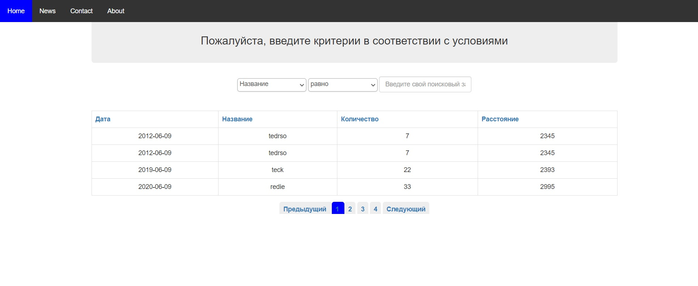

# weblex
Ajax Jquery  PHP MYSQL Sorting, Filtering and Pagination

A web based application developed using Ajax Jquery  PHP MYSQL . An iterative and user friendly Sorting, Filtering and Pagination functionality table.

## Desktop, Tablet, Mobile

## Live Demo Deployed in Heroku
https://tedweblexsite.herokuapp.com/

## Author

👤 **Tedros Tesfay**

- Github: [tta2yta](https://github.com/tta2yta)
- Email: tta2yta@gmail.com

👤

## 🤝 Contributing

Contributions, issues and feature requests are welcome!

Feel free to check the <a href="https://github.com/tta2yta/task_job_weblex/issues" target="_blank">issues page</a>.

